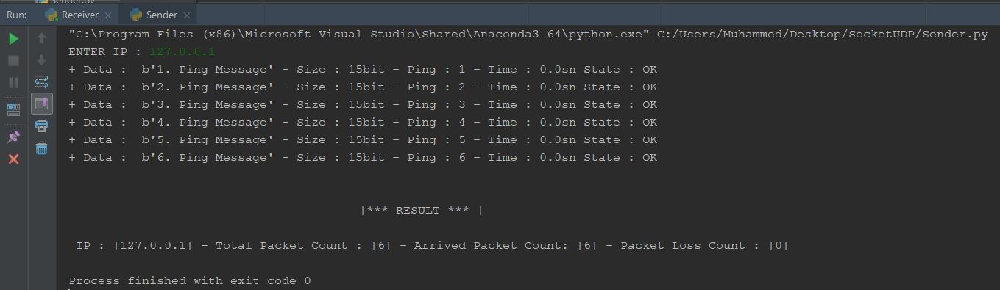
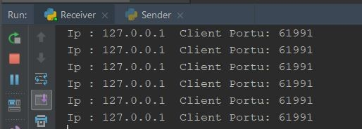
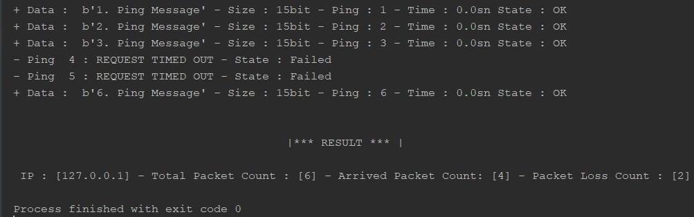

#UDP-Socket

UDP SOCKET
Projede 127.0.0.1 ip numaralı kendi bilgisayarıma 6 adet UDP paketi gönderilmiştir. 
Kendi bilgisayarıma olduğu için herhangi bir timeout durumu gerçekleşmemiştir. Ama timeout olması durumu test edilmiştir.
İsterseniz başka bir ip adresi girip uygulamayı test edebilir.

Client Çıktı:
 	
 
 	
Server Çıktı:
 
 

 Timeout olması durumundaki çıktı aşağıda verildiği gibidir.
 
 
-timeout olması durumundaki client çıktısı-

